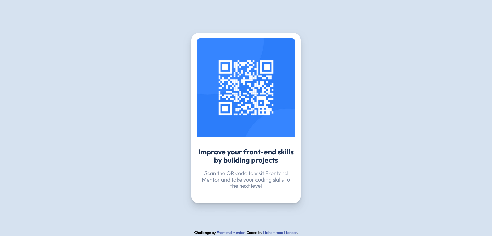

# Frontend Mentor - QR code component solution

This is a solution to the [QR code component challenge on Frontend Mentor](https://www.frontendmentor.io/challenges/qr-code-component-iux_sIO_H). Frontend Mentor challenges help you improve your coding skills by building realistic projects. 

## Table of contents

- [Overview](#overview)
  - [Screenshot](#screenshot)
  - [Links](#links)
- [My process](#my-process)
  - [Built with](#built-with)
  - [What I learned](#what-i-learned)
- [Author](#author)

## Overview
To get some details and background of this project visit the link below:
[Frontend Mentor | QR code component coding challenge](https://www.frontendmentor.io/challenges/qr-code-component-iux_sIO_H)

### Screenshot
Desktop version

Mobile version

### Links

- [GitHub Repository](https://github.com/Mohammad-Moneer/QR-Code-Component)
- [Live Demo](https://mohammad-moneer.github.io/QR-Code-Component/)

## My process

### Built with

- HTML
- CSS
- Flexbox

### What I learned

- Centering element within the whole body
- Border radius

## Author

- Frontend Mentor - [@Mohammad-Moneer](https://www.frontendmentor.io/profile/Mohammad-Moneer)